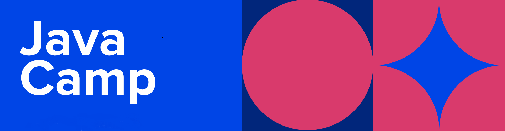

# Pharmagator     

## 1. About the project

Open source project developed by Eleks-Java-Camp team! ...

## 2. How to contribute

You're encouraged to contribute to our project if you've found any issues or missing functionality that you would want to see. Here you can see [the list of issues](https://github.com/Oleksandr-Eleks/pharmagator/issues) and here you can create [a new issue](https://github.com/Oleksandr-Eleks/pharmagator/issues/new).

Before sending any pull request, please discuss requirements/changes to be implemented using an existing issue or by creating a new one. All pull requests should be done into `develop` branch.

## 3. Start the project locally

### 3.1. Required to install

* Java 17
* PostgreSQL

### 3.2. How to run

1. You should create database `pharmagator` and set your db username and password as `'postgres'` .

